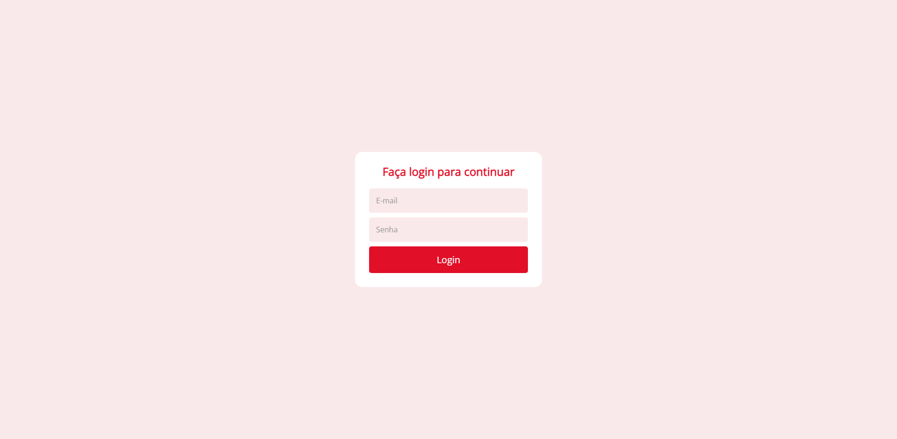
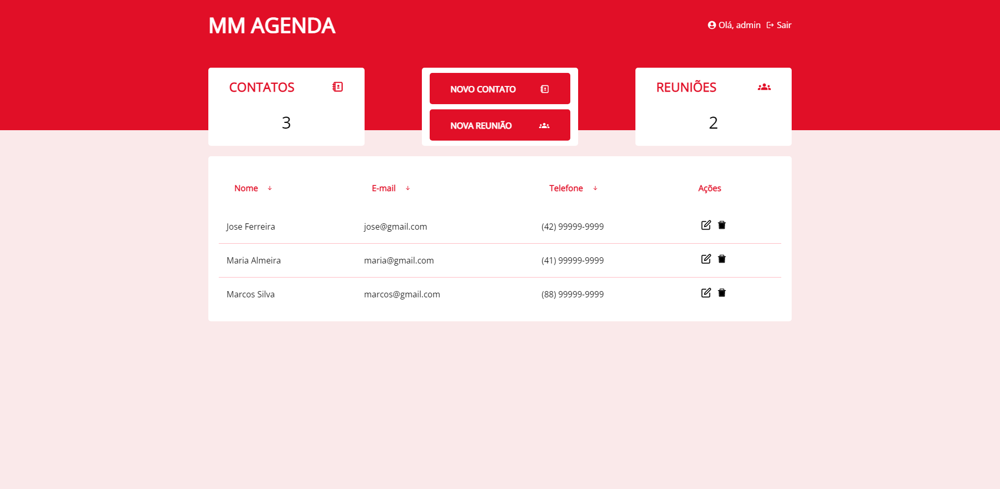
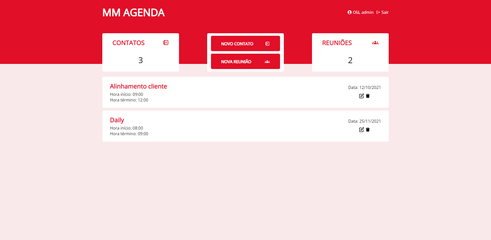
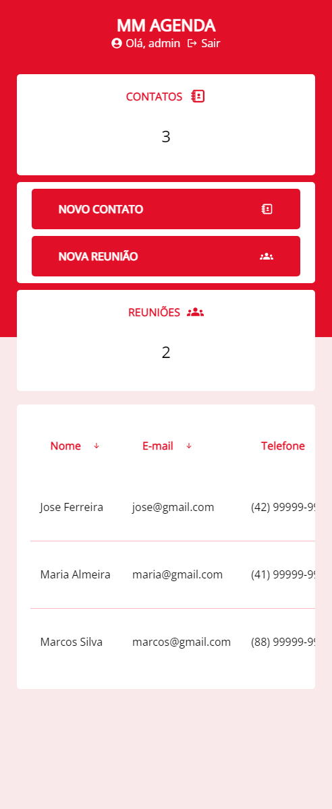
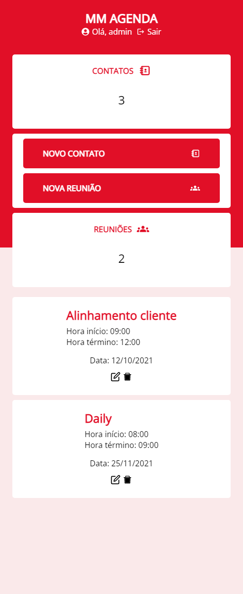
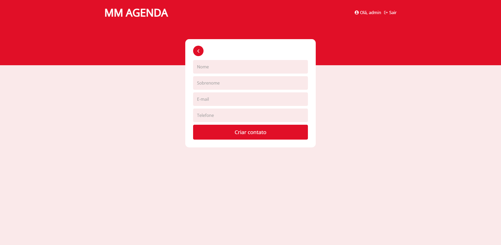
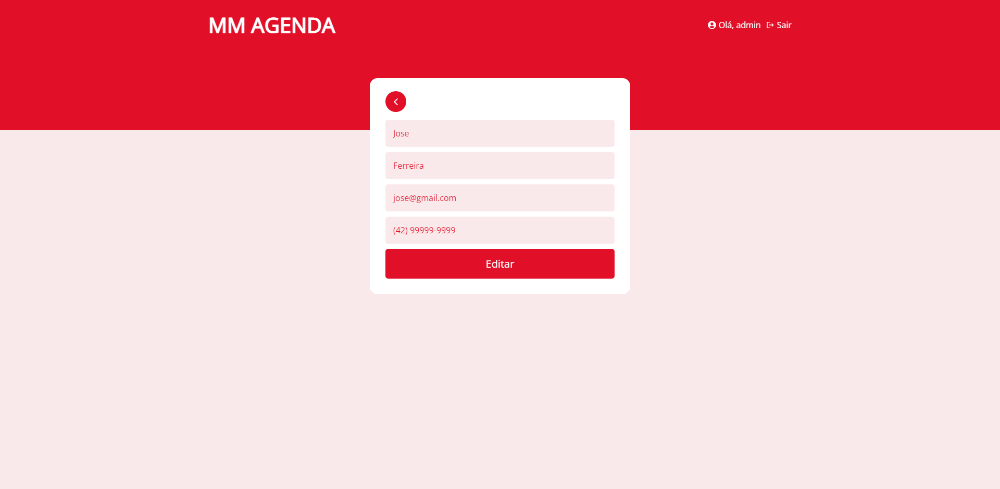
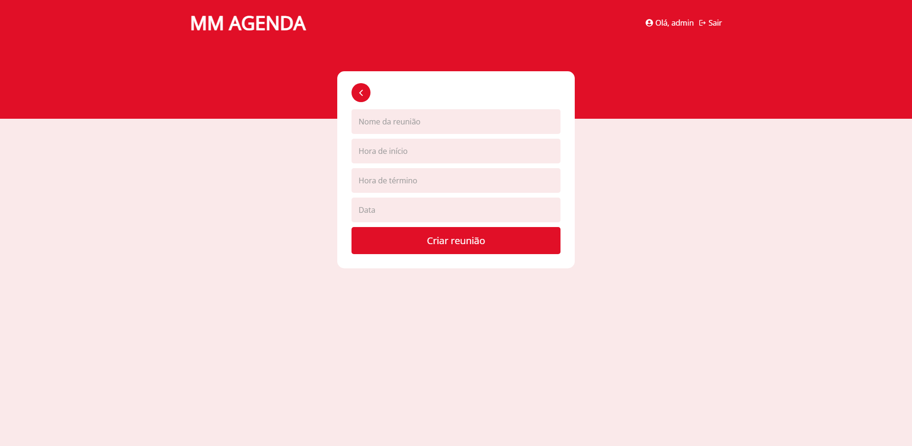
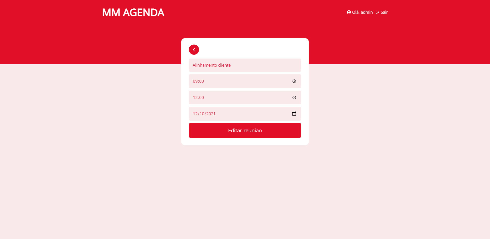

# MM Agenda

Aplicação desenvolvida com ReactJS que permite o cadastro de contatos e reuniões.

## Tecnologias e ferramentas utilizadas

- ReactJS como framework e core do projeto
- SASS para css estruturado
- React Icons para os ícones
- Axios para requisições http
- React Input Mask para máscaras nos inputs de formulário
- React Hook Form para validações de formulário

## Dependências

Instale as dependências do projeto

```bash
npm install
```

## Rodando o projeto

Compile e rode a versão de produção (Certifique-se de que o back end esteja rodando em http://127.0.0.1:3333)

```bash
yarn build
yarn global add serve
serve -s build
```

Caso o comando serve -s build não funcione, use `npx serve -s build`

Abra [http://localhost:5000](http://localhost:5000) no seu navegador.

Faça o login:

Email: admin@admin.com /
Password: admin

## Componentes

| Nome         | Responsabilidade                                                                                                                           |
| ------------ | ------------------------------------------------------------------------------------------------------------------------------------------ |
| Header       | Mostrar logo e usuário logado                                                                                                              |
| BoxesMenu    | Mostrar o menu em caixas com as informações de contatos e reuniões, bem como os link para suas respectivas listas e formulários de criação |
| ContactsList | Mostrar a lista de contatos em uma tabela permitindo a ordenação por nome, email ou telefone além dos links para edição e exclusão         |
| MeetingsList | Mostrar a lista de reuniões ordenada de forma ascendente pela data da reunião, e os links para edição e exclusão                           |

## Estrutura de pastas

Cada página está separada em uma subpasta no diretório src/pages, e os estilos estão organizados em suas respectivas pastas.

## Contact

| Pasta               | Rota               | Responsabilidade                         |
| ------------------- | ------------------ | ---------------------------------------- |
| pages/contacts      | /contacts          | Mostra a lista de contatos               |
| pages/contacts/edit | /contacts/edit/:id | Mostra o formulário de edição de contato |
| pages/contacts/new  | /contacts/new/     | Mostra o formulário de novo contato      |

## Meeting

| Pasta               | Rota               | Responsabilidade                         |
| ------------------- | ------------------ | ---------------------------------------- |
| pages/meetings      | /meetings          | Mostra a lista de reuniões               |
| pages/meetings/edit | /meetings/edit/:id | Mostra o formulário de edição de reunião |
| pages/meetings/new  | /meetings/new/     | Mostra o formulário de nova reunião      |

## Login

| Pasta       | Rota   | Responsabilidade             |
| ----------- | ------ | ---------------------------- |
| pages/login | /login | Mostra o formulário de login |

## Services

| Arquivo | Responsabilidade                                  |
| ------- | ------------------------------------------------- |
| api     | Setar a url base e enviar o token de autenticação |

## Contextos

Contextos estão localizados na pasta contexts e separados em seus respectivos arquivos.

| Arquivo         | Responsabilidade                                                                                     |
| --------------- | ---------------------------------------------------------------------------------------------------- |
| AuthContext     | Tratar e persistir a autenticação e prover os dados do usuário e da sessão para todos os componentes |
| ContactsContext | Guardar e prover os dados dos contatos                                                               |
| MeetingsContext | Guardar e prover os dados das reuniões                                                               |

# Telas do projeto

## Login



## Listagem de contatos



## Listagem de reuniões



## Listagens mobile




## Formulários de cadastro e edição de contato




## Formulários de cadastro e edição de reuniao




### Fim
